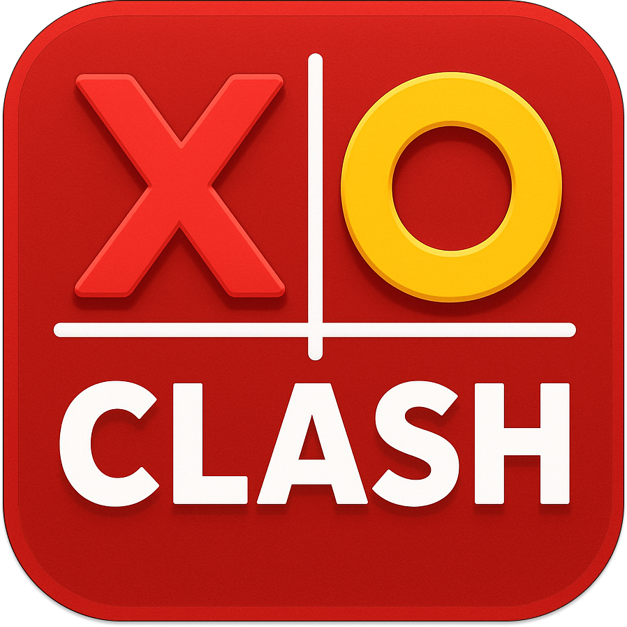

# XO Clash



A modern, collaborative Tic Tac Toe game built with Flutter, featuring **Feature-First Clean Architecture**, dependency injection, and multiple game modes.


## 📋 Table of Contents

- [Available Platforms](#-available-platforms)
- [Features](#-features)
- [Installation & Configuration](#-installation--configuration)
- [Usage](#-usage)
- [Architecture](#-architecture)
- [Development](#-development)
- [Localization System](#-localization-system)
- [Testing](#-testing)
- [TODO & Known Issues](#-todo--known-issues)
- [License](#-license)
- [Contributing](#-contributing)
- [Author](#-author)

## 📱 Available Platforms

XO Clash is built with Flutter and runs on:
- 📱 **iOS** (iOS 15.0+)
- 🤖 **Android** (API 21+)
- 🌐 **Web**
- 💻 **macOS** (macOS 10.15+)

## ✨ Features

### Game Modes
- **Online Mode**: Play with friends online using game codes
- **Local Friend Mode**: Play with a friend on the same device
- **Computer Mode**: Challenge AI opponents with 3 difficulty levels
  - 🌱 **Easy**: Perfect for beginners
  - ⚡ **Medium**: Balanced challenge
  - 👑 **Hard**: Expert-level AI

### Gameplay
- **Flexible Board Sizes**: 3×3, 4×4, or 5×5 boards
- **Customizable Symbols**: Choose between classic shapes or emojis for X and O
- **Real-time Updates**: Live game state synchronization in online mode
- **Game History**: Track your past games and results
- **Statistics**: View wins, losses, draws, and win rates

### User Experience
- **Modern UI**: Dark theme with vibrant red accents and smooth gradients
- **Smooth Animations**: Polished transitions and visual effects
- **Sound Effects**: Audio feedback for moves, wins, and draws
- **Confetti Celebrations**: Visual celebrations when you win
- **Dark/Light Mode**: Toggle between themes
- **Localization**: Available in English and French

### Authentication & Persistence
- **Social Sign-In**: Sign in with Google or Apple
- **Guest Mode**: Play without authentication
- **Local Persistence**: Games and settings saved locally
- **User Profiles**: Customizable usernames and avatars

## 🔨 Architecture

This project follows **Clean Architecture** principles with a **Feature-First** approach, organizing code by features rather than layers.

**📋 Architecture Decision Records (ADRs):** See [`docs/adr/`](docs/adr/) for documented architectural decisions.

```
┌─────────────────────────────────────────┐
│         Feature Module                  │
│  ┌───────────────────────────────────┐ │
│  │  Presentation Layer               │ │
│  │  (UI, Widgets, Providers, Screens) │ │
│  └──────────────┬────────────────────┘ │
│                 │                       │
│  ┌──────────────▼────────────────────┐ │
│  │  Domain Layer                      │ │
│  │  (Entities, Use Cases, Repos)     │ │
│  └──────────────┬────────────────────┘ │
│                 │                       │
│  ┌──────────────▼────────────────────┐ │
│  │  Data Layer                        │ │
│  │  (Data Sources, Repository Impl)  │ │
│  └───────────────────────────────────┘ │
└─────────────────────────────────────────┘
```

### Key Principles
- **Feature-First**: Code organized by features (auth, game, history, etc.)
- **Clean Architecture**: Each feature follows Clean Architecture layers
- **Dependency Inversion**: Domain layer is independent of data layer
- **Backend Abstraction**: Data sources depend on abstract backend services (easily replaceable)
- **Use Cases**: Business logic encapsulated in use cases (53 use cases, 100% coverage)
- **Use Case Pattern Enforcement**: All providers use use cases exclusively - no direct repository calls
- **Pure Riverpod DI**: Single unified dependency injection system (see [ADR-0003](docs/adr/0003-pure-riverpod-di.md))
- **Coordinator Navigation**: Decoupled navigation using coordinator pattern (see [ADR-0008](docs/adr/0008-coordinator-navigation-pattern.md))
- **State Management**: Riverpod for reactive state management
- **Repository Pattern**: Abstract data access through repositories

### Dependency Injection Strategy

The project uses **pure Riverpod** for all dependency injection (see [ADR-0003](docs/adr/0003-pure-riverpod-di.md)).

#### Architecture Overview

All services, repositories, and data sources are defined as Riverpod providers in `lib/core/providers/service_providers.dart`:

```dart
// Services
final loggerServiceProvider = Provider<LoggerService>(
  (ref) => LoggerServiceImpl(),
);

final audioServiceProvider = Provider<AudioService>(
  (ref) => AudioServiceImpl(ref.watch(loggerServiceProvider)),
);

// Repositories
final userRepositoryProvider = Provider<UserRepository>(
  (ref) => UserRepositoryImpl(dataSource: ref.watch(userDataSourceProvider)),
);
```

#### Why This Approach?

1. **Simplicity**: Single DI system to understand
2. **No code generation**: No need for `build_runner` for DI
3. **Testability**: All providers easily overridable in tests via `ProviderContainer`
4. **Clear dependency graph**: `ref.watch()` makes dependencies explicit

#### Usage in Notifiers

```dart
class UserNotifier extends Notifier<User?> {
  Future<void> _loadUser() async {
    final logger = ref.read(loggerServiceProvider);
    logger.debug('Loading user');
  }
}
```

#### Testing Pattern

```dart
late ProviderContainer container;

setUp(() {
  container = ProviderContainer(
    overrides: [
      userRepositoryProvider.overrideWithValue(mockUserRepository),
    ],
  );
});
```

### Navigation Strategy

The project uses a **Coordinator Pattern** for navigation to decouple views from routing implementation (see [ADR-0008](docs/adr/0008-coordinator-navigation-pattern.md)).

#### Architecture Overview

Views emit `FlowEvent`s instead of calling navigation directly:

```dart
// View emits event
class HomeScreen extends ConsumerWidget {
  @override
  Widget build(BuildContext context, WidgetRef ref) {
    return ElevatedButton(
      onPressed: () {
        navigate(ref, RequestNewGame());
      },
      child: Text('New Game'),
    );
  }
}
```

The `FlowCoordinator` dispatches events to feature-specific coordinators:

```dart
// FlowCoordinator routes to appropriate coordinator
class FlowCoordinator {
  void handle(FlowEvent event) {
    for (final coordinator in _coordinators) {
      if (coordinator.canHandle(event)) {
        coordinator.handle(event);
        return;
      }
    }
  }
}
```

Each coordinator handles navigation for its feature:

```dart
// Feature coordinator handles navigation
class HomeCoordinator extends BaseCoordinator {
  @override
  void handle(FlowEvent event) {
    switch (event) {
      case RequestNewGame():
        navigation.toGameMode();
      // ...
    }
  }
}
```

#### Why This Approach?

1. **Decoupling**: Views don't know about routing implementation
2. **Testability**: Coordinators are easily testable in isolation
3. **Maintainability**: Navigation logic centralized per feature
4. **Scalability**: Easy to add new coordinators without modifying existing ones
5. **No God Class**: Chain of Responsibility avoids large switch statements

## 🚀 Installation & Configuration

### Prerequisites

- **FVM (Flutter Version Manager)** - Recommended for managing Flutter versions
  - Install: `dart pub global activate fvm`
  - Or via Homebrew: `brew tap leoafarias/fvm && brew install fvm`
- Flutter SDK (>=3.6.0) - Managed via FVM
- Dart SDK (>=3.6.0) - Included with Flutter
- Android Studio / Xcode (for mobile development)
- Git

### Steps

1. **Clone the repository**
   ```bash
   git clone <repository-url>
   cd Tictac
   ```

2. **Install Flutter version using FVM** (if using FVM)
   ```bash
   fvm install
   fvm use
   ```

   This will install and use the Flutter version specified in `.fvmrc`.

3. **Install dependencies**
   ```bash
   # If using FVM
   fvm flutter pub get

   # Or if using Flutter directly
   flutter pub get
   ```

4. **Generate code** (required for Freezed)

   The project uses code generation for immutable data classes. You **must** run build_runner before running the app:

   ```bash
   # If using FVM
   fvm flutter pub run build_runner build --delete-conflicting-outputs

   # Or if using Flutter directly
   flutter pub run build_runner build --delete-conflicting-outputs
   ```

   This generates:
   - Freezed data classes (`*.freezed.dart` files)

   See the [Code Generation with Build Runner](#code-generation-with-build-runner) section for more details.

5. **Run the app**
   ```bash
   # If using FVM
   fvm flutter run

   # Or if using Flutter directly
   flutter run
   ```

### Firebase Setup

**Required for online mode and authentication.**

Follow the complete setup guide: [`docs/FIREBASE_SETUP.md`](docs/FIREBASE_SETUP.md)

**Quick Start:**
```bash
# 1. Install FlutterFire CLI
dart pub global activate flutterfire_cli

# 2. Configure Firebase for all platforms
flutterfire configure

# 3. Follow prompts to select project and platforms
```

This generates `lib/firebase_options.dart` with all configuration.

**Additional Documentation:**
- [`docs/adr/`](docs/adr/) - Architecture Decision Records (ADRs)
- [`docs/WEB_DEPLOYMENT.md`](docs/WEB_DEPLOYMENT.md) - Web deployment guide

### Google Sign-In Setup

1. Configure OAuth 2.0 credentials in Google Cloud Console
2. Add the client ID to `android/app/build.gradle` and iOS configuration
3. Follow [Google Sign-In setup guide](https://pub.dev/packages/google_sign_in)

### Apple Sign-In Setup

1. Enable Sign in with Apple in Apple Developer Console
2. Configure capabilities in Xcode
3. Follow [Sign in with Apple setup guide](https://pub.dev/packages/sign_in_with_apple)

## 📖 Usage

### Getting Started

1. **Launch the app** and sign in (optional)
2. **Choose a game mode**:
   - Online: Create or join a game with a code
   - Local Friend: Play with someone on the same device
   - Computer: Challenge AI at different difficulty levels
3. **Select board size**: 3×3, 4×4, or 5×5
4. **Start playing**: Tap cells to place your symbol

### Game Modes

#### Online Mode
- Create a game to get a unique game code (6 characters)
- Share the code with a friend
- Friend joins using the code with validation
- Play in real-time with live updates
- **Note**: Requires Firebase configuration (see `docs/FIREBASE_SETUP.md`)
- **Without Firebase**: Online mode UI works but uses local storage (same-device only)

⚠️ **Important**: Online mode uses Firebase Firestore for real-time synchronization. Firebase setup is required (see `docs/FIREBASE_SETUP.md`).

#### Local Friend Mode
- Enter your friend's name
- Play on the same device
- Take turns placing symbols

#### Computer Mode
- Choose difficulty: Easy, Medium, or Hard
- Play against AI
- AI makes moves automatically

### Settings

Access settings from the home screen:

- **Appearance**: Toggle dark/light mode
- **Sound Effects**: Enable/disable audio feedback
- **Animations**: Enable/disable visual animations
- **Language**: Switch between English and French
- **Symbols**: Customize X and O with shapes or emojis
- **Profile**: Edit username and avatar

### Statistics

View your game statistics:
- Total wins, losses, and draws
- Win rate percentage
- Game history with details
- Session scores

### Project Structure

The project follows a **Feature-First** architecture where each feature is self-contained with its own data, domain, and presentation layers:

```
lib/
├── core/                            # Shared code across features
│   ├── app.dart                     # Main app widget
│   ├── constants/                   # App-wide constants
│   │   ├── app_constants.dart
│   │   ├── audio_constants.dart
│   │   ├── error_constants.dart
│   │   ├── game_constants.dart
│   │   ├── language_codes.dart
│   │   ├── logger_constants.dart
│   │   └── ui_constants.dart
│   ├── domain/                      # Core domain entities
│   │   └── errors/                  # Error handling
│   │       └── app_exception.dart
│   ├── errors/                      # Error handling utilities
│   │   ├── error_handler.dart
│   │   └── error_helpers.dart
│   ├── extensions/                  # Extension methods
│   │   ├── color_extensions.dart
│   │   └── localizations_extension.dart
│   ├── playbook/                    # Component library
│   │   ├── playbook_helpers.dart
│   │   ├── playbook_screen.dart
│   │   ├── playbook_stories.dart
│   │   ├── playbook_strings.dart
│   │   └── widgets/                  # Playbook widget scenarios
│   ├── presentation/                # Core presentation layer
│   │   └── errors/                  # Error presentation
│   │       ├── app_exception_localizations.dart
│   │       └── error_extensions.dart
│   ├── providers/                   # Shared providers
│   ├── navigation/                   # Navigation coordination
│   │   ├── coordinator.dart          # Base coordinator interface
│   │   ├── flow_coordinator.dart     # Main flow coordinator
│   │   ├── flow_events.dart          # Navigation events
│   │   └── coordinators/             # Feature coordinators
│   │       ├── auth_coordinator.dart
│   │       ├── game_coordinator.dart
│   │       ├── home_coordinator.dart
│   │       ├── navigation_coordinator.dart
│   │       └── onboarding_coordinator.dart
│   ├── routing/                     # Routing configuration
│   │   ├── app_router.dart
│   │   ├── app_router.gr.dart        # Generated
│   │   └── splash_route_wrapper.dart
│   ├── services/                    # Shared services
│   │   ├── app_info_service.dart
│   │   ├── app_info_service_impl.dart
│   │   ├── audio_service.dart
│   │   ├── audio_service_impl.dart
│   │   ├── logger_service.dart
│   │   ├── logger_service_impl.dart
│   │   ├── navigation_service.dart
│   │   └── navigation_service_impl.dart
│   ├── theme/                       # App theming
│   │   └── app_theme.dart
│   ├── spacing/                      # Spacing system
│   │   ├── app_spacing.dart
│   │   └── README.md
│   ├── utils/                        # Utility functions
│   │   └── system_ui_helper.dart
│   └── widgets/                      # Shared widgets (organized by category)
│       ├── ai/                       # AI-related widgets
│       ├── avatars/                  # Avatar selection widgets
│       ├── branding/                 # Logo and branding widgets
│       ├── buttons/                  # Button components
│       ├── effects/                  # Visual effects (confetti, backgrounds)
│       ├── emojis/                   # Emoji selection widgets
│       ├── formatters/               # Text formatters
│       ├── inputs/                   # Input field widgets
│       ├── shapes/                   # Shape/symbol widgets
│       ├── snackbars/                # Snackbar notifications
│       ├── ui/                       # Generic UI components
│       └── README.md                 # Widget organization guide
├── features/                        # Feature modules
│   ├── auth/                        # Authentication feature
│   │   ├── data/
│   │   │   ├── datasources/
│   │   │   └── services/
│   │   ├── domain/
│   │   │   └── usecases/
│   │   │       ├── validate_email_usecase.dart
│   │   │       ├── validate_password_usecase.dart
│   │   │       └── validate_username_usecase.dart
│   │   └── presentation/
│   │       ├── providers/
│   │       ├── screens/
│   │       │   ├── auth_screen.dart
│   │       │   ├── login_screen.dart
│   │       │   └── signup_screen.dart
│   │       └── widgets/
│   ├── game/                        # Game feature
│   │   ├── data/
│   │   │   ├── datasources/
│   │   │   │   ├── local_game_datasource.dart
│   │   │   │   └── remote_game_datasource.dart
│   │   │   ├── repositories/
│   │   │   │   └── game_repository_impl.dart
│   │   │   └── services/
│   │   │       ├── game_backend_service.dart
│   │   │       └── firebase_game_backend_service.dart
│   │   ├── domain/
│   │   │   ├── entities/
│   │   │   │   ├── game_state.dart
│   │   │   │   └── game_state_extensions.dart
│   │   │   ├── repositories/
│   │   │   │   └── game_repository.dart
│   │   │   ├── strategies/
│   │   │   │   ├── ai_strategy.dart
│   │   │   │   ├── ai_strategy_factory.dart
│   │   │   │   ├── easy_ai_strategy.dart
│   │   │   │   ├── medium_ai_strategy.dart
│   │   │   │   └── hard_ai_strategy.dart
│   │   │   └── usecases/
│   │   │       ├── validate_game_id_usecase.dart
│   │   │       ├── create_game_usecase.dart
│   │   │       ├── create_offline_game_usecase.dart
│   │   │       ├── make_move_usecase.dart
│   │   │       ├── make_computer_move_usecase.dart
│   │   │       ├── select_ai_move_usecase.dart
│   │   │       ├── check_winner_usecase.dart
│   │   │       ├── check_has_winning_move_usecase.dart
│   │   │       ├── check_move_leads_to_draw_usecase.dart
│   │   │       ├── check_can_force_draw_usecase.dart
│   │   │       ├── get_available_moves_usecase.dart
│   │   │       ├── count_remaining_moves_usecase.dart
│   │   │       ├── get_game_result_info_usecase.dart
│   │   │       ├── get_player_name_usecase.dart
│   │   │       ├── get_win_message_usecase.dart
│   │   │       ├── handle_game_completion_usecase.dart
│   │   │       └── join_game_usecase.dart
│   │   └── presentation/
│   │       ├── providers/
│   │       ├── screens/
│   │       │   ├── game_screen.dart
│   │       │   ├── game_mode_screen.dart
│   │       │   └── board_size_screen.dart
│   │       └── widgets/
│   │           ├── game_board.dart
│   │           ├── game_info.dart
│   │           ├── game_result_helper.dart
│   │           └── game_result_snackbar.dart
│   ├── history/                     # Game history feature
│   ├── home/                        # Home screen feature
│   ├── onboarding/                  # Onboarding feature
│   ├── score/                       # Score/statistics feature
│   ├── settings/                    # Settings feature
│   ├── splash/                      # Splash screen feature
│   └── user/                        # User profile feature
├── l10n/                            # Localization files
│   ├── app_en.arb
│   ├── app_fr.arb
│   ├── app_localizations.dart
│   ├── app_localizations_en.dart
│   └── app_localizations_fr.dart
├── test_utils/                      # Test utilities and helpers
└── main.dart                        # App entry point
```

**Feature Structure:**

Each feature follows the same structure:

```
features/{feature}/
├── data/                            # Data layer
│   ├── datasources/                 # Data sources (local, remote)
│   ├── repositories/                # Repository implementations
│   └── services/                    # Backend service implementations (optional)
├── domain/                          # Domain layer (business logic)
│   ├── entities/                    # Business entities
│   ├── repositories/                # Repository interfaces
│   ├── strategies/                  # Business strategies (e.g., AI strategies)
│   └── usecases/                    # Use cases
└── presentation/                    # Presentation layer
    ├── providers/                   # Riverpod providers
    ├── screens/                     # Feature screens
    └── widgets/                     # Feature-specific widgets
```

### Technologies

**Core:**
- **Flutter** 3.6+ - UI framework (managed via FVM)
- **Dart** 3.2+ - Programming language
- **FVM** - Flutter Version Manager

**State Management & DI:**
- **Riverpod** 3.0+ - Reactive state management and dependency injection
- **Riverpod Generator** 3.0+ - Code generation for providers

**Architecture:**
- **Build Runner** 2.10+ - Code generation tool
- **Auto Route** 11.1+ - Declarative routing

**Data Persistence:**
- **SharedPreferences** 2.5+ - Local storage
- **Firebase Firestore** - Real-time cloud database

**Code Generation:**
- **Freezed** 3.2+ - Immutable data classes
- **Freezed Annotation** 3.1+ - Annotations for Freezed

**Testing:**
- **Mocktail** 1.0+ - Mocking framework
- **Flutter Test** - Unit and widget testing

## 🧪 Testing

### Running Tests

```bash
# Run all tests
# If using FVM
fvm flutter test

# Or if using Flutter directly
flutter test

# Run tests with coverage
# If using FVM
fvm flutter test --coverage

# Or if using Flutter directly
flutter test --coverage

# Run specific test file
# If using FVM
fvm flutter test test/features/game/domain/usecases/create_game_usecase_test.dart

# Or if using Flutter directly
flutter test test/features/game/domain/usecases/create_game_usecase_test.dart

# Generate component snapshots
# If using FVM
fvm flutter test test/core/playbook/playbook_snapshot_test.dart

# Or if using Flutter directly
flutter test test/core/playbook/playbook_snapshot_test.dart
```

### Test Structure

Tests mirror the feature-first structure and follow TDD principles:

```
test/
├── core/                    # Tests for shared code
│   ├── extensions/         # Extension method tests
│   ├── providers/         # Provider tests
│   ├── services/          # Service tests
│   ├── spacing/           # Spacing system tests
│   ├── theme/             # Theme tests
│   ├── widgets/           # Widget tests
│   └── playbook/          # Component snapshot tests
├── features/               # Feature tests
│   ├── auth/
│   ├── game/
│   │   ├── data/
│   │   ├── domain/
│   │   └── presentation/
│   ├── history/
│   ├── score/
│   ├── settings/
│   └── user/
└── widget_test.dart
```

**Test Quality Standards:**
- Tests follow TDD principles (test behavior, not implementation)
- Clear structure with spacing between Arrange-Act-Assert sections
- No redundant comments (structure is self-evident)
- Focus on business logic and edge cases

### Test Coverage

The project maintains **91% code coverage** on core business logic (badge updated automatically via scripts).

**To update the coverage badge:**
```bash
bash scripts/generate_coverage_report.sh
```

#### What's Tested ✅

**Data Layer:**
- Datasources (local, remote, history, score, settings, user): 95-100%
- Repositories: 100%
- JSON parsing and serialization
- Error handling and edge cases

**Domain Layer:**
- Usecases: 100% (50 use cases, all tested)
- Entities and value objects: 100%
- Business logic and game rules
- Use case pattern enforced: All providers use use cases exclusively

**Core:**
- Services (Logger, Audio, AppInfo)
- Utilities (Extensions, Routing)
- Dependency injection setup

**Test Types:**
- Unit tests for use cases and repositories
- Integration tests with Mocktail mocks
- Provider tests with Riverpod
- Widget tests for critical components
- Edge case and error path testing

#### What's Excluded ❌

The following are excluded from coverage metrics (not from testing) to focus on business logic:

- **Presentation layer** (`*/presentation/*`) - UI screens, providers, widgets
- **Constants** (`*/constants/*`) - Static configuration values
- **Localization** (`*/l10n/*`) - Auto-generated translation files
- **UI Widgets** (`*/core/widgets/*`) - Reusable UI components
- **Playbook** (`*/playbook/*`) - Component library (dev tool)

**Why exclude these?**
- UI components are tested manually and via Playbook snapshots
- Presentation logic is covered by integration tests
- Coverage metrics focus on testable business logic
- Reduces noise and improves coverage signal-to-noise ratio

#### Test Statistics

- **845 tests** across 120+ test files
- **92% coverage** on core business logic
- **100% coverage** on repositories and all use cases
- **53 use case test files** - Every use case has dedicated tests
- **Mocktail** for mocking (no code generation needed)
- **0 warnings, 0 errors** - Clean codebase

**Mocking Framework:**
The project uses [Mocktail](https://pub.dev/packages/mocktail) for mocking dependencies in tests. Mocktail is preferred over Mockito because:
- No code generation required (faster development)
- Null-safe by default
- Simpler API
- Better IDE support

**Code Quality:**
- **0 warnings, 0 errors** - All lint rules passing
- **Type inference** - Leveraged for cleaner, more readable code
- **Public API compliance** - Only public APIs used (no internal imports)
- **Comprehensive lint rules** - 100+ rules from Flutter style guide enforced

### Component Library (Playbook)

The project uses [Playbook](https://pub.dev/packages/playbook) to document and test reusable UI components.

**Access the Component Library:**
- In debug mode, go to Settings > Component Library (Playbook)
- Browse all reusable widgets with different states and configurations
- View components in isolation without app dependencies

**Available Component Stories:**
- `GameButton` (`buttons/`) - Various button styles and states
- `AppLogo` (`branding/`) - App logo in different themes
- `CosmicBackground` (`effects/`) - Background component
- `AvatarSelector` (`avatars/`) - Avatar selection widget
- `ModalBottomSheet` (`ui/`) - Modal component
- `EmojiSelector` (`emojis/`) - Emoji selection widget
- `ShapeSelector` (`shapes/`) - Shape selection widget
- `ConfettiWidget` (`effects/`) - Celebration confetti effect
- `TextField` (`ui/`) - Text input fields with various configurations
- `UsernameTextField` (`inputs/`) - Reusable username input with consistent styling (dark/light mode)
- `Cards` (`ui/`) - Card components with different styles
- `GameIdTextFormatter` (`formatters/`) - Input formatter for game codes (uppercase, validation)
- `JoinGameSection` - Complete join game widget with validation and error handling

**Note:** Core widgets are organized into subdirectories by category. See `lib/core/widgets/README.md` for the complete structure.

**Generate Snapshots:**
```bash
flutter test test/core/playbook/playbook_snapshot_test.dart
```

This generates visual snapshots of all components for visual regression testing.

```bash
# If using FVM
fvm flutter test test/core/playbook/playbook_snapshot_test.dart

# Or if using Flutter directly
flutter test test/core/playbook/playbook_snapshot_test.dart
```

## 🔧 Development

### Code Generation with Build Runner

The project uses [build_runner](https://pub.dev/packages/build_runner) for code generation. Build Runner is a tool that generates code based on annotations in your Dart files.

#### What is Generated?

The project uses code generation for:

1. **Freezed** - Immutable data classes
   - Generates: `*.freezed.dart` files (e.g., `settings.freezed.dart`)
   - When: After modifying `@freezed` classes or their properties
   - Purpose: Generates `copyWith`, `toString`, `==`, `hashCode`, and JSON serialization

2. **Riverpod Generator** - Provider generation (if used)
   - Generates: `*.g.dart` files for providers
   - When: After modifying `@riverpod` annotations
   - Purpose: Generates type-safe providers

#### Running Build Runner

**One-time build** (recommended for CI/CD):
```bash
# If using FVM
fvm flutter pub run build_runner build --delete-conflicting-outputs

# Or if using Flutter directly
flutter pub run build_runner build --delete-conflicting-outputs
```

**Watch mode** (auto-regenerate on file changes - recommended during development):
```bash
# If using FVM
fvm flutter pub run build_runner watch --delete-conflicting-outputs

# Or if using Flutter directly
flutter pub run build_runner watch --delete-conflicting-outputs
```

**Clean and rebuild** (if you encounter issues):
```bash
# If using FVM
fvm flutter pub run build_runner clean
fvm flutter pub run build_runner build --delete-conflicting-outputs

# Or if using Flutter directly
flutter pub run build_runner clean
flutter pub run build_runner build --delete-conflicting-outputs
```

#### When to Run Build Runner

You need to run build_runner when:
- ✅ After cloning the repository (first-time setup)
- ✅ After modifying `@freezed` classes (adding/removing properties)
- ✅ After pulling changes that include generated files
- ✅ When you see errors about missing `.freezed.dart` files
- ✅ After updating dependencies that use code generation

**Note:** Generated files (`.freezed.dart`, `.g.dart`) should **not** be manually edited. They are automatically generated and will be overwritten.

#### Generated Files Location

Generated files are placed next to their source files:
- `lib/features/settings/domain/entities/settings.dart` → `lib/features/settings/domain/entities/settings.freezed.dart`
- `lib/features/*/presentation/providers/*.dart` → `lib/features/*/presentation/providers/*.g.dart` (if using Riverpod Generator)

#### Troubleshooting

If build_runner fails:
1. **Clean build**: Run `fvm flutter pub run build_runner clean`
2. **Clean Flutter**: Run `fvm flutter clean`
3. **Reinstall dependencies**: Run `fvm flutter pub get`
4. **Rebuild**: Run `fvm flutter pub run build_runner build --delete-conflicting-outputs`

The `--delete-conflicting-outputs` flag automatically deletes conflicting generated files, which is useful when switching branches or after major refactorings.

### Adding New Features

When adding a new feature, follow the feature-first structure:

1. **Create feature directory**: `lib/features/{feature_name}/`
2. **Domain Layer**: Define entities, use cases, and repository interfaces in `domain/`
   - **CRITICAL**: Every business operation MUST have a use case
   - Use cases encapsulate all business logic and validation
   - Use cases depend on repository interfaces (not implementations)
3. **Data Layer**: Implement repositories and data sources in `data/`
   - Repositories implement domain interfaces
   - Data sources handle actual data persistence
4. **Presentation Layer**: Create UI, providers, and widgets in `presentation/`
   - **ARCHITECTURE RULE**: Providers MUST use use cases, NEVER call repositories directly
   - Create use case providers in `{feature}_providers.dart`
   - Access use cases via `ref.read(useCaseProvider)` in Notifiers
5. **Dependency Injection**:
   - Add new providers to `lib/core/providers/service_providers.dart`
   - Create Riverpod providers for use cases
   - Use `ref.read(provider)` in Notifiers
6. **Tests**: Write tests mirroring the feature structure in `test/features/{feature_name}/`
   - **MANDATORY**: Every use case MUST have a dedicated test file
   - Test use cases in isolation with mocked repositories
   - Test providers with mocked use cases
7. **Run tests**: Ensure all tests pass

**Example: Adding a New Feature Operation**

```dart
// 1. Create use case in domain layer
// lib/features/user/domain/usecases/update_email_usecase.dart
class UpdateEmailUseCase {
  final UserRepository _userRepository;

  UpdateEmailUseCase(this._userRepository);

  Future<User> execute(User? currentUser, String newEmail) async {
    // Business logic: validation, transformation
    final trimmedEmail = newEmail.trim();
    final updatedUser = User(
      username: currentUser?.username ?? '',
      email: trimmedEmail,
      avatar: currentUser?.avatar,
    );
    await _userRepository.saveUser(updatedUser);
    return updatedUser;
  }
}

// 2. Create provider in presentation layer
// lib/features/user/presentation/providers/user_providers.dart
final updateEmailUseCaseProvider = Provider<UpdateEmailUseCase>(
  (ref) => UpdateEmailUseCase(ref.watch(userRepositoryProvider)),
);

// 3. Use in Notifier (✅ GOOD)
class UserNotifier extends AsyncNotifier<User?> {
  UpdateEmailUseCase get updateEmailUseCase => ref.read(updateEmailUseCaseProvider);

  Future<void> updateEmail(String newEmail) async {
    final currentUser = state.value;
    final updatedUser = await updateEmailUseCase.execute(currentUser, newEmail);
    state = AsyncData(updatedUser);
  }
}

// ❌ BAD: Direct repository call (violates architecture)
class UserNotifier extends AsyncNotifier<User?> {
  Future<void> updateEmail(String newEmail) async {
    // DON'T DO THIS
    await userRepository.saveUser(...);
  }
}

// 4. Create test file
// test/features/user/domain/usecases/update_email_usecase_test.dart
// (Test all scenarios: success, validation, error handling)
```

### Code Style

The project follows Flutter/Dart style guidelines:
- Use `flutter_lints` for linting with comprehensive rules from Flutter style guide
- Follow Clean Architecture principles
- **Write self-documenting code through clear naming** - Method and variable names should clearly express their purpose
- **No explanatory comments in business logic** - Code should read like a story. Instead of comments, use descriptive method names (e.g., `_isOfflineGame()` instead of `// Check if offline game`)
- **Documentation only in UseCases/Repositories** - Business logic documentation belongs in domain layer only
- **Type inference for private code** - Use type inference for local variables and private methods to reduce verbosity
- **Explicit types for public APIs** - Always specify types for public classes, methods, functions, and fields (enforced by `type_annotate_public_apis`)
- **No internal imports** - Use only public APIs from dependencies (no `package:*/src/*` imports)
- Tests follow TDD principles (test behavior, not implementation)
- Tests use clear spacing between Arrange-Act-Assert sections (no redundant comments)
- **0 warnings, 0 errors** - Codebase maintains clean analysis with all lint rules passing

**Example of self-documenting code:**
```dart
// ❌ Bad: Comment explains what the code does
// Check if offline game
if (!gameState.isOnline && gameState.gameMode != null) {
  return updatedAvatar;
}

// ✅ Good: Method name is self-explanatory
if (_isOfflineGame(gameState)) {
  return updatedAvatar;
}

bool _isOfflineGame(GameState gameState) {
  return !gameState.isOnline && gameState.gameMode != null;
}
```

### Logging

Logging is done through the `LoggerService` via Riverpod:
```dart
// In Notifiers/Providers
final logger = ref.read(loggerServiceProvider);
logger.info('Message');
logger.error('Error message', error, stackTrace);
```

### Input Validation

The project follows Clean Architecture principles with validation logic in the domain layer:

**Validation Use Cases:**
- `ValidateUsernameUseCase` - Username validation (2-20 characters) in `features/auth/domain/usecases/`
- `ValidateEmailUseCase` - Email format validation in `features/auth/domain/usecases/`
- `ValidatePasswordUseCase` - Password strength validation in `features/auth/domain/usecases/`
- `ValidateGameIdUseCase` - Game code validation (6 characters, specific charset) in `features/game/domain/usecases/`

**Usage:**
```dart
// In widgets, access via providers
final validator = ref.read(validateUsernameUseCaseProvider);
final error = validator.execute(value, context.l10n);
```

**Custom input formatters:**
- `GameIdTextFormatter` - Auto-formats game codes (uppercase, filters invalid chars)

## 🌐 Localization System

The app uses Flutter's built-in localization system with **ARB (Application Resource Bundle)** files. The `gen-l10n` tool converts ARB files into type-safe Dart code.

### How It Works

**ARB Files** (`lib/l10n/`):
- `app_en.arb` - English translations (template)
- `app_fr.arb` - French translations
- JSON format with key-value pairs: `"key": "translated text"`

**Code Generation**:
```bash
flutter gen-l10n  # or fvm flutter gen-l10n
```

Generates:
- `app_localizations.dart` - Main localization class
- `app_localizations_en.dart` - English implementation
- `app_localizations_fr.dart` - French implementation

**Configuration** (`l10n.yaml`):
```yaml
arb-dir: lib/l10n
template-arb-file: app_fr.arb
output-localization-file: app_localizations.dart
```

**Usage in Code**:
```dart
Text(context.l10n.appTitle)  // Extension method
// or
Text(AppLocalizations.of(context).appTitle)
```

### Architecture Integration

**Language Management Flow:**
1. User selects language → `SettingsNotifier.setLanguage()`
2. `SetLanguageUseCase` updates `Settings` entity
3. `SettingsRepository` persists to `SharedPreferences`
4. `MaterialApp.locale` updated via Riverpod state
5. Flutter rebuilds UI with new locale

**Key Components:**
- `SetLanguageUseCase` - Business logic for language changes
- `SettingsRepository` - Persists language preference
- `SettingsNotifier` - Manages language state via Riverpod
- `AppLocalizations` - Generated translation classes

### Adding Translations

**New translation key:**
1. Add key to `app_en.arb` and `app_fr.arb`
2. Run `flutter gen-l10n`
3. Use: `Text(context.l10n.newKey)`

**New language:**
1. Create `app_es.arb` (copy from template)
2. Add language code to `LanguageCodes`
3. Update Settings UI
4. Run `flutter gen-l10n`

### ARB Format Examples

**Basic:**
```json
{
  "key": "value"
}
```

**With placeholders:**
```json
{
  "welcome": "Welcome, {name}!",
  "@welcome": {
    "placeholders": {
      "name": { "type": "String" }
    }
  }
}
```

Usage: `context.l10n.welcome('John')`

## 📝 TODO & Known Issues

### 🔴 Critical Priority

#### 1. Firebase Production Setup Required
**Status**: ⚠️ **REQUIRED FOR ONLINE MODE**
- **Current**: Firebase services use lazy loading - offline modes work without Firebase
- **Offline modes (Local Friend, Computer)**: ✅ Work without any Firebase setup
- **Online mode**: ⚠️ Requires Firebase configuration
- **Action Required for Online Mode**:
  - [ ] Run `flutterfire configure` (see `docs/FIREBASE_SETUP.md`)
  - [ ] Configure Firestore security rules for production
  - [ ] Set up Firebase Auth providers (Google, Apple, Email)
  - [ ] Add environment configuration (dev/staging/prod)
  - [ ] Configure OAuth credentials and redirect URIs
  - [ ] Deploy Firestore indexes if needed


### 🟡 High Priority

#### 3. Complete Auth Integration
- [ ] Add auth state persistence
- [ ] Test Firebase Auth flows end-to-end
- [ ] Implement account linking (anonymous → permanent)

#### 4. Environment Configuration
- [ ] Create `lib/core/config/env_config.dart`
- [ ] Support dev/staging/prod environments
- [ ] Use `--dart-define` for configuration
- [ ] Document environment setup in README

### 🔵 Low Priority / Nice to Have

#### 5. Features
- [ ] Leaderboards and rankings
- [ ] Tournament mode
- [ ] Additional board sizes (6×6, 7×7)
- [ ] Custom themes and color schemes
- [ ] Push notifications for game invites
- [ ] Social features (friends, challenges)
- [ ] Replay system with move history
- [ ] Undo move feature
- [ ] Game spectator mode


#### 6. Accessibility
- [ ] Add screen reader support
- [ ] Improve color contrast ratios
- [ ] Add haptic feedback options
- [ ] Support larger text sizes
- [ ] Add voice announcements for moves

#### 7. Analytics & Monitoring
- [ ] Add crash reporting (Sentry/Firebase Crashlytics)
- [ ] Implement analytics events
- [ ] Add performance monitoring
- [ ] Track user engagement metrics

---

## 📄 License

This project is private and not licensed for public use.

## 🤝 Contributing

This is a private project. Contributions are not currently accepted.

## 👤 Author

**Eric Vassille**

Developed with ❤️ in 🇫🇷.
